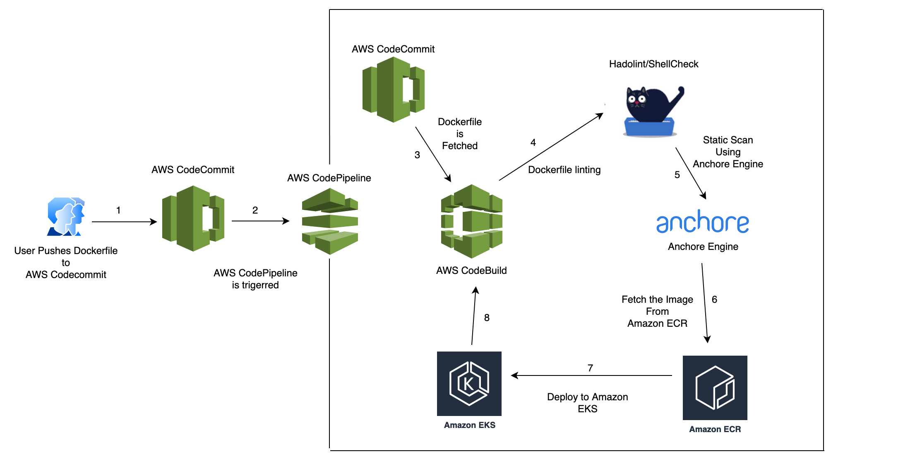
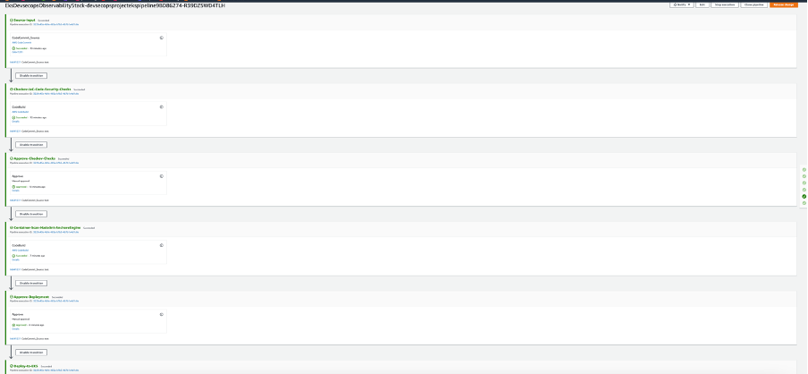
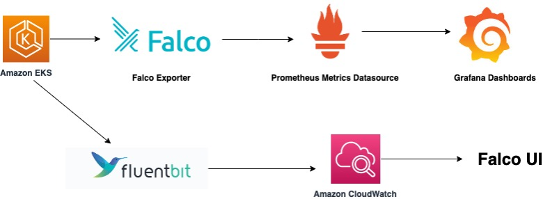
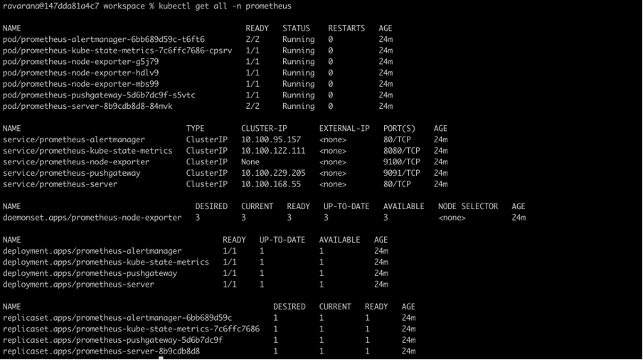
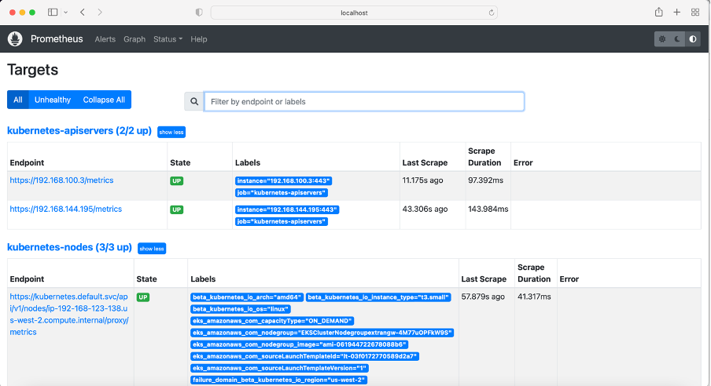
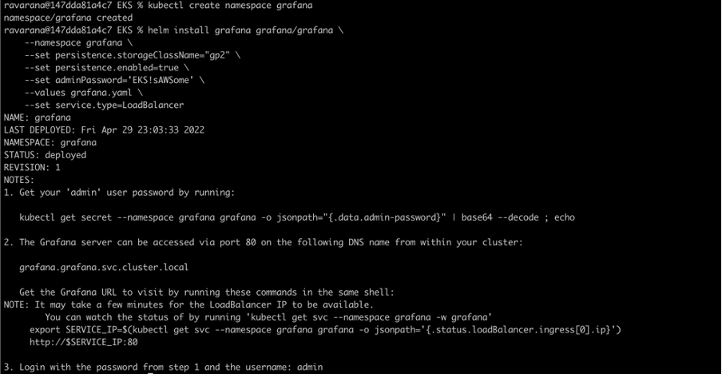
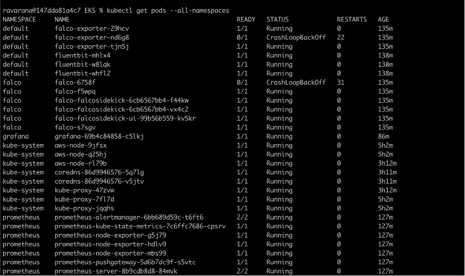
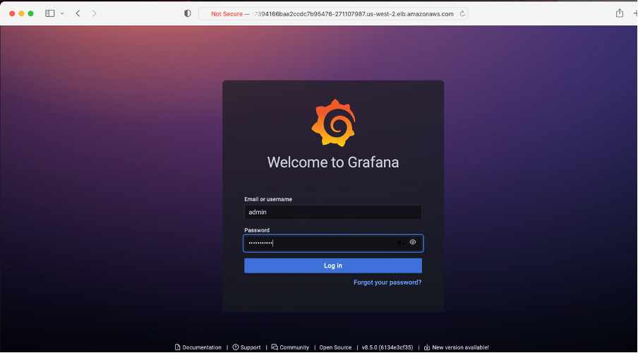
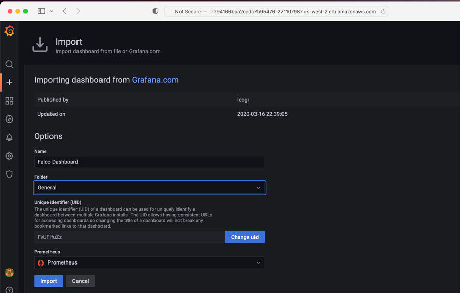
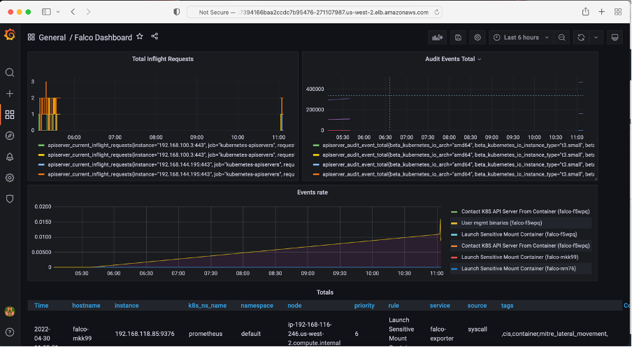

# Minimum DevSecOps with Monitoring Options on Amazon EKS

Many organizations are or are considering migrating their applications and/or software to containers over traditional virtual machines given that they are incredibly fast, easy to maintain, have simpler deployment life-cycles, and are much easier to spin up and down. This can greatly reduce the cost and increase efficiency. For a secure container life cycle management, container image hardening and end-to-end security checks are a most important and critical factor. Containers need to be secured by default before the containers are used or deployed.

This sample code base will demonstrate how to build an end to end DevSecOps pipeline on Amazon EKS using IaC code scanning static scanning and dynamic (runtime) scanning using native AWS services as well as 3rd party services and COntinous monitoring and alerting with Prometheus and Grafana. The products/services used are -

Hadolint/ShellCheck
Checkov
Anchore Engine
CNCF Falco Family (Falco, Sidekick & Sidekick-UI)
Prometheus
Garafana
Amazon CloudWatch


## Target Architecture




### DevSecOps Pipeline Execution Workflow in Depth 


**The Pipeline has three (3) AWS CodeBuild Phases -**

1. Code Build phase for IaC security best practises security checks using checkov
2. Code Build phase for performing the static scans using -
 a. Dockerfile or Docker Compose best practises security checks using using Hadolint/ShellCheck
 b. Deep Docker image best practises security checks using Anchore Engine
3. Dynamic/Runtime security checks using CNCF Falco


### Setup Instructions

Please follow below step-by-step instructions to setup the pipeline from scratch and clone the below Github repository as below –

```
git clone https://github.com/aws-samples/sample-eks-devsecops-with-monitoring
```

### Build the Pipeline

```
npm run build
cdk synth
cdk deploy
```
below is the screenshot of the sample pipeline -




## Monitoring Options

**Continous Monitoring can be done via**

(a) Amazon CloudWatch, CNCF Falco, Falco-UI, Falco Sidekick

(b) Or, Using Open source tools like Promethous/Grafana





### Option (a) : Continous Monitoring - CNCF Falco/Amazon CLoudWatch
Please follow my blog below to understand and implement runtime security using CNCF Falco, Falco-UI, Falco Sidekick. 

https://aws.amazon.com/blogs/containers/implementing-runtime-security-in-amazon-eks-using-cncf-falco/


**NOTE-** 

**fluent-bit** directory contains files to create a ConfigMap for Fluent Bit configuration, a Fluent Bit DaemonSet to run on all worker nodes, and finally a service account for the RBAC cluster role for authorization. All the files will be applied all at once.

### Option (b) :Continous Monitoring - Prometheus/Grafana


To export Falco events into Prometheus, we will need Falco Exporter. Please install Falco Exporter as a helm chart as below. Below steps are also available in [EKS Workshop](https://www.eksworkshop.com/intermediate/240_monitoring/)  –

```
helm install falco-exporter falcosecurity/falco-exporter
```

Next step is to create a separate namespace for Prometheus as below -

```
kubectl create namespace prometheus
```

now add and setup the Prometheus as helm start –

```
helm repo add prometheus-community https://prometheus-community.github.io/helm-charts
```

```
helm install prometheus prometheus-community/prometheus \
    --namespace prometheus \
    --set alertmanager.persistentVolume.storageClass="gp2" \
    --set server.persistentVolume.storageClass="gp2"
```

Make note of the Prometheus export endpoint which we will import into Grafana later to fetch the metrics data -

```
prometheus-server.prometheus.svc.cluster.local
```

You can also view the Prometheus pods in the Prometheus namespace we have just created in above steps like below -




Now get the Prometheus server URL by running these commands in the same shell:

```
  export POD_NAME=$(kubectl get pods --namespace prometheus -l "app=prometheus,component=server" -o jsonpath="{.items[0].metadata.name}")
  kubectl --namespace prometheus port-forward $POD_NAME 9090
```

Above command starts port-forwarding in the same shell which will help you to view the Prometheus dashboard using below URL - 

```
http://localhost:9090/targets
```

Below is the Prometheus dashboard which will list all the data it has collected from the EKS cluster –




### Setup Grafana for Continuous Observability

Create a separate namespace for Grafana for easier operations -

```
kubectl create namespace grafana
```

Create a sample Grafana configuration file garafana.yaml with below content -

```
datasources:
  datasources.yaml:
    apiVersion: 1
    datasources:
    - name: Prometheus
      type: prometheus
      url: http://prometheus-server.prometheus.svc.cluster.local
      access: proxy
      isDefault: true
```

**NOTE :** Please note the Prometheus export endpoint URL has been added to the Grafana datasources

And finally install Grafana usinh helm chart as below -

```
helm install grafana grafana/grafana \
    --namespace grafana \
    --set persistence.storageClassName="gp2" \
    --set persistence.enabled=true \
    --set adminPassword=<REPLACE WITH YOUR PASSWORD CHOICE> \
    --values grafana.yaml \
    --set service.type=LoadBalancer
```

**NOTE :** We are also setting up Grafana dashboard to be accesses through an ELB 


You should see the output as below for successful Grafana setup -



Now you can export the Grafana ELB access URL as below - 

```
export ELB=$(kubectl get svc -n grafana grafana -o jsonpath='{.status.loadBalancer.ingress[0].hostname}')
```

If you do ```echo http://$ELB``` you will see the ELB endpoint


**Optional** : At this stage you should have below output if you view all the pods in all the EKS cluster name spaces  - 




### Accessing Grafana 


Now you can open the Grafana dashboard using the ELB url from above export - 

To login into Grafana use the username as admin and retrieve the password as below. It is the same password we have setup manually in the grafana.yaml -

```
kubectl get secret --namespace grafana grafana -o jsonpath="{.data.admin-password}" | base64 --decode ; echo
```

Finally, we can open the Grafana dashboard and view the Falco events exported by Falco Exported into Grafana via Prometheus  as below – 



You can notice the Prometheus data source has been added already to Grafana -


### Import Metrics 

Now go to Imports page and import the Falco dashboard using the unique URL 

https://grafana.com/grafana/dashboards/11914

Or Using the json below -

https://github.com/falcosecurity/falco-exporter/blob/master/grafana/dashboard.json



Click on Import and you will finally see the Falco events on the Garafana dashboard captured through Falco Exporter and data source Prometheus as below – 


You can also create sample sub panels to the dashboard, for example I have added two new panels to the Falco Dashboard as below. You can create as many panels/dashboards to have singular views of the metrics exports from the Amazon EKS cluster via Falco Exporter -

just a sample dashboard (you can create any varierty of dashboards)




